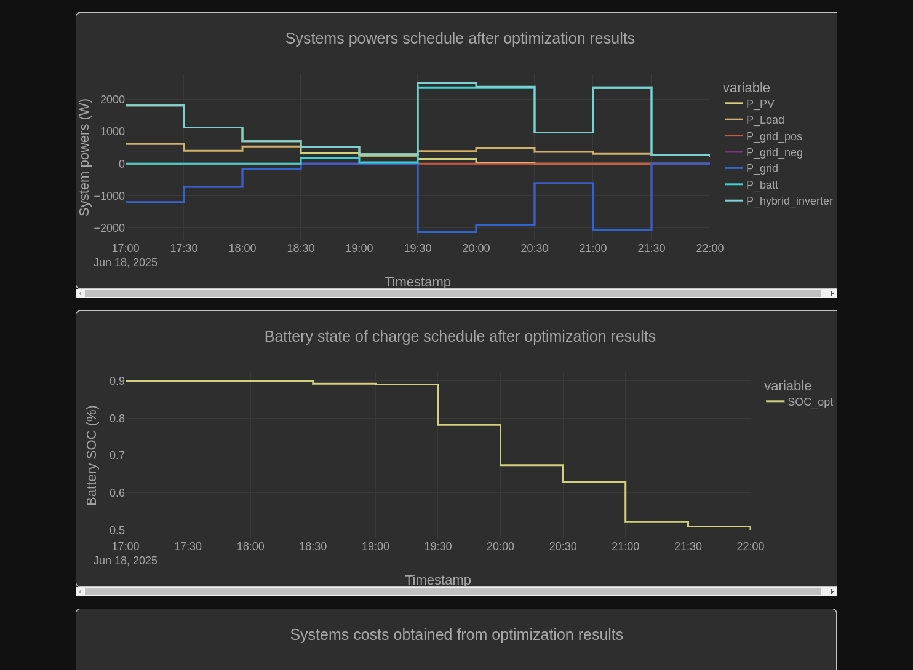

### Actual Brain

This parts contains 2 scripts organized by the entities which they use.
First is takes a look at the EMHASS calls and the SOLAX export limit since they share lot of variables.
Second is the strategy selector. Please create a folder /config/pyscript and put these 2 scripts there.
There is a todo -> expose the adjustment of the spot_prices to the user by a entity.

#### EMHASS calls

There is not much here also. Just calls to the EMHASS day-ahead optimization and the EMHASS MPC.
Please take a look at https://emhass.readthedocs.io/en/latest/lpems.html#the-emhass-optimizations nice grap.

Goal of these is to provide a plan that updates as the time goes by. You will need to probably adapt the names of the used entities to match your entities.
However, these are ready at the top of the script, so it should be relatively straightforward.



This is the script number 1:
```python

import logging
import asyncio
import aiofiles, aiohttp
import json

from zoneinfo import ZoneInfo
from datetime import datetime, timedelta

logger = logging.getLogger("spot_eval.pyscript")


MPC="naive-mpc-optim"
DAYAHEAD="dayahead-optim"
PUBLISH="publish-data"


async def call_emhass(action, json):
    """Post to emhass endpoint with json."""

    async with aiohttp.ClientSession() as session:
        async with session.post(
           f"http://localhost:5000/action/{action}",
            json=json
        ) as response:
            if response.status >= 400:
                raise aiohttp.ClientResponseError(
                    request_info=response.request_info,
                    history=response.history,
                    status=response.status
                )
            return await response.json()  # If expecting JSON response


# This is the OTE integation sensor, if you use something else, please adapt get_spot_prices function
# view the get_spot_prices_mpc for a spot price adjustments.
SENSOR_TODAY_SPOT = "sensor.current_spot_electricity_price"
SENSOR_TODAY_SPOT_BUY = "sensor.current_spot_electricity_price"
SENSOR_TODAY_SPOT_SELL = "sensor.current_spot_electricity_price"

# Weather integration
SENSOR_TODAY_WEATHER = "sensor.energy_production_today_2"
SENSOR_TOMORROW_WEATHER = "sensor.energy_production_tomorrow_2"
SENSOR_PRODUCTION = "sensor.energy_production_tomorrow_2"

# Solax
SENSOR_BATTERY_CAPACITY = "sensor.solax_battery_capacity"

# Sensor containing the current spot *sell* price
SENSOR_SELL_PRICE ="sensor.current_spot_electricity_sell_price"

# Solax field for changing the user limit
SENSOR_EXPORT_LIMIT = "number.solax_export_control_user_limit"

# Input sensor for saving the status
INPUT_SENSOR_EXPORT_ALLOWED = "input_boolean.export_allowed"
# Input sensor for modifying the minimum sell price
INPUT_SENSOR_SELL_THRESHOLD = "input_number.export_price_threshold"
# Input sensor that defines the maximum limit restoration
INPUT_SENSOR_RESTORE_EXPORT_ALLOWED = "input_number.maximum_export_allowed"

def get_spot_prices_day_ahead(now, attributes, price_adjustment):
    """Get the prices from the forecast."""
    prices = []
    forecast = [(k, v) for k, v in attributes.items() if
                k != "unit_of_measurement" and k != "icon" and k != "friendly_name"]

    for k, v in forecast:
        v_a = v
        date = datetime.fromisoformat(k)

        if date < now:
            continue

        # doing this since the prices are hourly and we plan each 30 minutes
        prices += [v_a + price_adjustment, v_a + price_adjustment] 

        if len(prices) == LINES_LIMIT:
            break

    return prices

@time_trigger("cron(0 23 * * *)")
def dayahead():
    lines_limit = 48

    """Perform Dayahead optimization."""
    now = datetime.now(ZoneInfo("Europe/Prague"))


    attributes = hass.states.get(SENSOR_TODAY_SPOT_BUY).attributes
    load_cost_forecast = get_spot_prices_day_ahead(now, attributes)

    attributes = hass.states.get(SENSOR_TODAY_SPOT_SELL).attributes
    prod_price_forecast =  get_spot_prices_day_ahead(now, attributes)

    pv_power_forecast = []

    today_attributes = hass.states.get(SENSOR_TODAY_WEATHER).attributes

    for k, v in today_attributes["watts"].items():
        date = datetime.fromisoformat(k)

        if date < now:
            continue

        if date.minute == 0 or date.minute == 30:
            pv_power_forecast += [v]

        if len(pv_power_forecast) == lines_limit:
            break

    tomorrow_attributes = hass.states.get(SENSOR_TOMORROW_WEATHER).attributes

    for k, v in tomorrow_attributes["watts"].items():
        date = datetime.fromisoformat(k)


        if date.minute == 0 or date.minute == 30:
            pv_power_forecast += [v]

        if len(pv_power_forecast) == lines_limit:
            break

    soc_init = hass.states.get(SENSOR_BATTERY_CAPACITY).state
    soc_raw = hass.states.get(SENSOR_TOMORROW_WEATHER).state

    if float(soc_raw) < 20 :
        soc_final = 0.7
    else:
        soc_final = 0.5

    payload = {
        "pv_power_forecast" : pv_power_forecast,
        "load_cost_forecast" : load_cost_forecast,
        "prod_price_forecast" : prod_price_forecast,
        "soc_init": float(soc_init) / 100,
        "soc_final": soc_final,
        }


    try:
        await call_emhass(DAYAHEAD, payload)
        await call_emhass(PUBLISH, {})
    except Exception as e:
        print(e)


    logger.info("Finished the dayahead optim")

def get_spot_prices_mpc(attributes, lines_limit, now, tomorrow, price_adjustment):
    """Get the spot prices for the mpc."""
    prices = []
    forecast = [(k, v) for k, v in attributes.items() if
                k != "unit_of_measurement" and k != "icon" and k != "friendly_name"]
    for k, v in forecast:
        v_a = v

        date = datetime.fromisoformat(k)

        if now < date < tomorrow:
            prices += [v_a + price_adjustment] 

        if len(prices) == lines_limit:
            break

        n = date + timedelta(minutes=30)

        if now < n < tomorrow:
            prices += [v_a  + price_adjustment]

        if len(prices) == lines_limit:
            break
    return prices


@time_trigger("cron(0/5 *  * * *)")
def mpc():
    """This is the optimization happening mid day"""
    now = datetime.now(ZoneInfo("Europe/Prague"))
    tomorrow = None
    if now.hour > 23:
        t = now + timedelta(days=1)
        tomorrow = datetime(year=t.year, month=t.month, day=t.day, hour=23, tzinfo=ZoneInfo("Europe/Prague"))
    else:
        tomorrow = datetime(year=now.year, month=now.month, day=now.day, hour=23, tzinfo=ZoneInfo("Europe/Prague"))

    lines_limit = int((tomorrow - now).total_seconds() / 60 // 30)


    # Early return we do not perform optimizations as per the emhass docs if the ending of the day is close.
    if lines_limit < 6:
        return

    attributes = hass.states.get(SENSOR_TODAY_SPOT_BUY).attributes
    # price is increased by the distribution and extra from your provider
    load_cost_forecast = get_spot_prices_mpc(attributes, lines_limit, now, tomorrow, 0.5 + 2.5)

    attributes = hass.states.get(SENSOR_TODAY_SPOT_SELL).attributes
    prod_price_forecast = get_spot_prices_mpc(attributes, lines_limit, now, tomorrow, -0.5)


    pv_power_forecast = []

    today_attributes = hass.states.get(SENSOR_TODAY_WEATHER).attributes
    tomorrow_attributes = hass.states.get(SENSOR_TOMORROW_WEATHER).attributes

    for k, v in [x for x in today_attributes["watts"].items()] + [x for x in tomorrow_attributes['watts'].items()]:
        date = datetime.fromisoformat(k)

        if (date.minute == 0 or date.minute == 30) and (now < date and date < tomorrow):
            pv_power_forecast += [v]

        if len(pv_power_forecast) == lines_limit:
            break


    soc_init = hass.states.get(SENSOR_BATTERY_CAPACITY).state
    soc_raw = hass.states.get(SENSOR_TOMORROW_WEATHER).state

    if float(soc_raw) < 20 :
        soc_final = 0.7
    else:
        soc_final = 0.5


    print(f"pv_power - {len(pv_power_forecast)}, load - {len(load_cost_forecast)} ")

    payload = {
        "pv_power_forecast" : pv_power_forecast,
        "load_cost_forecast" : load_cost_forecast,
        "prod_price_forecast" : prod_price_forecast,
        "soc_init": float(soc_init) / 100,
        "soc_final": soc_final,
        "prediction_horizon": lines_limit
        }


    try:
        await call_emhass(MPC, payload)
        await call_emhass(PUBLISH, {})
    except Exception as e:
        print(e)


    logger.info("Finished the mpc optim")

@state_trigger("True", watch=[SENSOR_SELL_PRICE])
def enable_disable_solax_grid_export():
  """Enable or disable the export based on your sell price"""

  previous_limit = int(hass.states.get(SENSOR_EXPORT_LIMIT).state)
  spot_price = hass.states.get(SENSOR_SELL_PRICE).state
  sell_threshold = hass.states.get(INPUT_SENSOR_SELL_THRESHOLD).state
  restore_limit = hass.states.get(INPUT_SENSOR_RESTORE_EXPORT_ALLOWED).state

  logger.debug(f"Previous value {previous_limit} - {float(spot_price)} ")

  if float(spot_price) > float(sell_threshold):
    out = restore_limit
    service.call("input_boolean", "turn_on", entity_id=INPUT_SENSOR_EXPORT_ALLOWED)
  else:
    out = 0
    service.call("input_boolean", "turn_off", entity_id=INPUT_SENSOR_EXPORT_ALLOWED)

  # to avoid storing to EMPROM on each evaluation
  if previous_limit != out:
    logger.debug(f"Changing solax export limit from {previous_limit} to {out}")
    service.call("number", "set_value", entity_id=SENSOR_EXPORT_LIMIT, value=out)
  else:
    logger.debug("No change to solax export limit {previous_limit} - {out}")

```

#### Solax enable disable

This section is already included in the previous file, but i would just highlight it here.
We are taking look at the spot price and comparing it to user defined sell threshold. Based on that we set the export limit in solax.
Each write to the solax is written to write-limited (100 000 - you probably know), but this happens 2x or 4 times a day max.

```python

@state_trigger("True", watch=[SENSOR_SELL_PRICE])
def enable_disable_solax_grid_export():
  """Enable or disable the export based on your sell price"""

  previous_limit = int(hass.states.get(SENSOR_EXPORT_LIMIT).state)
  spot_price = hass.states.get(SENSOR_SELL_PRICE).state
  sell_threshold = hass.states.get(INPUT_SENSOR_SELL_THRESHOLD).state
  restore_limit = hass.states.get(INPUT_SENSOR_RESTORE_EXPORT_ALLOWED).state

  logger.debug(f"Previous value {previous_limit} - {float(spot_price)} ")

  if float(spot_price) > float(sell_threshold):
    out = restore_limit
    service.call("input_boolean", "turn_on", entity_id=INPUT_SENSOR_EXPORT_ALLOWED)
  else:
    out = 0
    service.call("input_boolean", "turn_off", entity_id=INPUT_SENSOR_EXPORT_ALLOWED)

  # to avoid storing to EMPROM on each evaluation
  if previous_limit != out:
    logger.debug(f"Changing solax export limit from {previous_limit} to {out}")
    service.call("number", "set_value", entity_id=SENSOR_EXPORT_LIMIT, value=out)
  else:
    logger.debug("No change to solax export limit {previous_limit} - {out}")
```

#### Strategy selector

Honestly this script could be improved quite a bit, but it works for me. I will probably do once I have some energy.

Before trying to understand this, please take a look at the outputs from EMHASS.
Here we are taking a look at the variables the EMHASS give us: https://emhass.readthedocs.io/en/latest/lpems.html#the-emhass-optimizations
This script updates the strategy entity.


This is the script number 2:
```python
import logging

logger = logging.getLogger("spot_eval.pyscript")

## Do not change unless you know what you are doing
SELL_TO_GRID = "Sell to grid"
CHARGE = "Charge"
DISCHARGE = "Discharge"
NO_ACTION = "No action"


# Change to the forecast sensors from emhass.
SENSOR_PV_FORECAST = "sensor.p_pv_forecast"
SENSOR_P_LOAD_FORECAST = "sensor.p_load_forecast"
SENSOR_P_BATT_FORECAST = "sensor.p_batt_forecast"
SENSOR_P_GRID_FORECAST = "sensor.p_grid_forecast"


# Change to the solax battery
SENSOR_BATTERY_CAPACITY = "sensor.solax_battery_capacity"

# INPUT_SELECTOR used to save the strategy
INPUT_INVERTOR_STRATEGY = "input_select.invertor_strategy"


@state_trigger("1 == 1",
               watch=[SENSOR_PV_FORECAST, SENSOR_P_LOAD_FORECAST, SENSOR_P_BATT_FORECAST, SENSOR_P_GRID_FORECAST])
def select_strategy():
    p_pv = float(hass.states.get(SENSOR_PV_FORECAST).state)
    p_load = float(hass.states.get(SENSOR_P_LOAD_FORECAST).state)
    p_grid = float(hass.states.get(SENSOR_P_GRID_FORECAST).state)
    p_batt = float(hass.states.get(SENSOR_P_BATT_FORECAST).state)

    soc = float(hass.states.get(SENSOR_BATTERY_CAPACITY).state)

    strategy = select(p_pv, p_load, p_grid, p_batt, soc)

    service.call("input_select", "select_option", entity_id=INPUT_INVERTOR_STRATEGY, option=strategy)

    logger.debug("Strategy chosen")


# b_batt -> negative is charging, positive is discharge
# feel free to modify the strategy selection
def select(p_pv: int, p_load: int, p_grid: int, p_batt: int, soc: float) -> str:
    # check for charging

    if (p_batt < 0 and p_grid > 0) and (- p_batt > (0.5 * p_grid)):
        return CHARGE

    if (p_batt > 0 and p_grid < 0) and (p_batt > (0.5 * - p_grid)):
        return DISCHARGE

    if p_batt < 500 and p_grid < 0 and soc < 85:
        return SELL_TO_GRID

    return NO_ACTION

```

