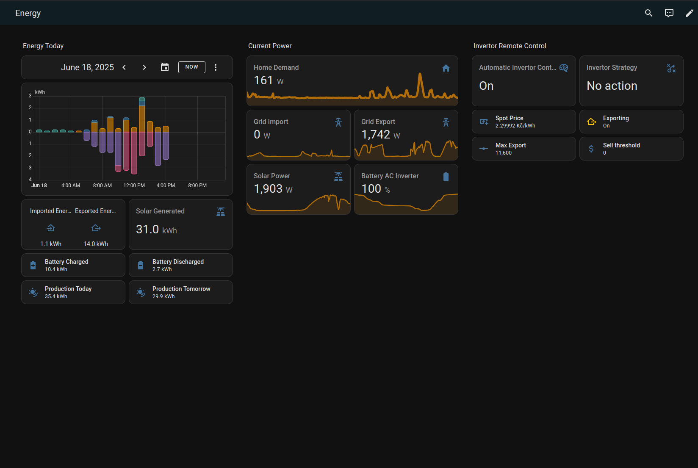

You can use this yaml to create your own dashboard. I 'collected' this dashboards while browsing somewhere. Thank you original author.
I added few tiles here and there.




```yaml
views:
  - title: Energy
    path: energy
    icon: mdi:sun-angle-outline
    type: sections
    sections:
      - type: grid
        cards:
          - type: heading
            heading: Energy Today
          - type: energy-date-selection
            action: default
          - type: energy-usage-graph
            action: default
          - type: glance
            entities:
              - entity: sensor.solax_today_s_import_energy
                name: Imported Energy
              - entity: sensor.solax_today_s_export_energy
                name: Exported Energy
            layout_options:
              grid_columns: 2
              grid_rows: 2
          - type: entity
            entity: sensor.solax_today_s_solar_energy
            name: Solar Generated
            icon: mdi:solar-power-variant
          - type: tile
            entity: sensor.solax_battery_input_energy_today
            name: Battery Charged
            icon: mdi:battery-plus-variant
          - type: tile
            entity: sensor.solax_battery_output_energy_today
            name: Battery Discharged
            icon: mdi:battery-minus-variant
          - type: tile
            entity: sensor.energy_production_today_2
            name: Production Today
            icon: mdi:sun-wireless
            features_position: bottom
            vertical: false
          - type: tile
            entity: sensor.energy_production_tomorrow_2
            name: Production Tomorrow
            icon: mdi:sun-wireless
            features_position: bottom
            vertical: false
            grid_options:
              columns: 6
              rows: 1
        column_span: 1
      - type: grid
        cards:
          - type: heading
            heading: Current Power
          - graph: line
            type: sensor
            entity: sensor.solax_house_load
            detail: 2
            name: Home Demand
            layout_options:
              grid_columns: full
            icon: mdi:home
          - graph: line
            type: sensor
            entity: sensor.solax_grid_import
            detail: 2
            name: Grid Import
            icon: mdi:transmission-tower
          - graph: line
            type: sensor
            entity: sensor.solax_grid_export
            detail: 2
            name: Grid Export
            icon: mdi:transmission-tower
          - graph: line
            type: sensor
            entity: sensor.solax_pv_power_total
            detail: 2
            name: Solar Power
            icon: mdi:solar-power-variant
          - graph: line
            type: sensor
            entity: sensor.solax_battery_capacity
            detail: 2
            layout_options:
              grid_columns: 2
              grid_rows: 2
            name: Battery AC Inverter
      - type: grid
        cards:
          - type: heading
            heading_style: title
            heading: Invertor Remote Control
          - type: entity
            entity: input_boolean.automatic_invertor_control_enabled
            name: Automatic Invertor Control Enabled
          - type: entity
            entity: input_select.invertor_strategy
          - type: tile
            entity: sensor.current_spot_electricity_sell_price
            features_position: bottom
            vertical: false
            name: Spot Price
          - type: tile
            entity: input_boolean.export_allowed
            features_position: bottom
            vertical: false
            icon: mdi:home-export-outline
            name: Exporting
            grid_options:
              columns: 6
              rows: 1
            tap_action:
              action: none
            icon_tap_action:
              action: none
          - type: tile
            entity: input_number.maximum_export_allowed
            features_position: bottom
            vertical: false
            name: Max Export
          - type: tile
            entity: input_number.export_price_threshold
            features_position: bottom
            vertical: false
            icon: mdi:currency-usd
    header:
      layout: center
      badges_position: bottom
    max_columns: 4
    cards: []
```
